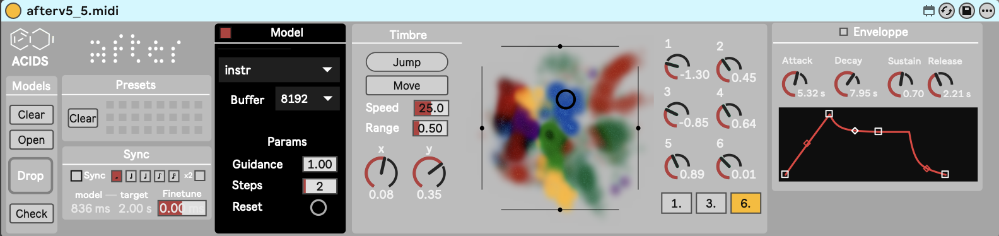
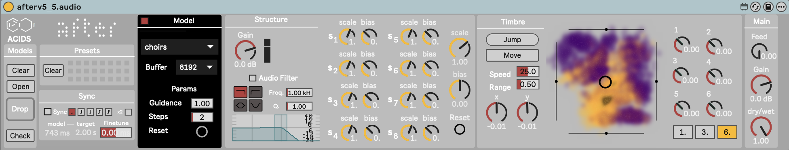

# AFTER: Audio Features Transfer and Exploration in Real-time

__AFTER__ is a diffusion-based generative model that creates new audio by blending two sources: one audio stream to set the style or timbre, and another input (either audio or MIDI) to shape the structure over time.

This repository is a real-time implementation of the research paper _Combining audio control and style transfer using latent diffusion_ ([read it here](https://arxiv.org/abs/2408.00196)) by Nils Demerlé, P. Esling, G. Doras, and D. Genova. Some transfer examples can be found on the [project webpage](https://nilsdem.github.io/control-transfer-diffusion/). This real-time version integrates with MaxMSP and Ableton Live through [_nn_tilde_](https://github.com/acids-ircam/nn_tilde), an external that embeds PyTorch models into MaxMSP.

If you use AFTER as a part of a music performance or installation, be sure to cite either this repository or the article !

If you want to share / discuss / ask things about AFTER and other research from ACIDS, you can do so in our [discord server](https://discord.gg/r9umPrGEWv) !

You can find pretrained models and max patches for realtime inference in the last section of this page.

### Installation

After can be installed in python 3.12 environnement by cloning this repository :

``` bash
git clone https://github.com/acids-ircam/AFTER.git
cd AFTER/
pip install -e .
```

If you want to use the model in MaxMSP or PureData for real-time generation, please refer to the [_nn_tilde_](https://github.com/acids-ircam/nn_tilde) external documentation and follow the installation steps.

---

## Model Training

AFTER is a latent diffusion model that operates in the latent space of an autoencoder, hence training involves 3 separated steps: _dataset preparation_, _autoencoder training_, and _diffusion model training.

We provide more detailed explanations about AFTER design and training in the [training guide](docs/training_guide.md).

---

### Step 1 — Dataset Preparation

All training data must be preprocessed into an LMDB database first. Two independant data processing are required to train the autoencoder and the diffusion model. 

#### Waveform-only dataset (for autoencoder training)

```bash
after prepare_dataset \
  --input_path /audio/folder \
  --output_path /dataset/path_audio \
  --save_waveform True
```

#### Latent embedding dataset (for diffusion training)

```bash
after prepare_dataset \
  --input_path /audio/folder \
  --output_path /dataset/path_latent \
  --emb_model_path AE_model_run/export.ts
```

Multiple input directories can be passed, which will create one LMDB database per directory:

```bash
after prepare_dataset \
  --input_path /audio/folder1 \
  --input_path /audio/folder2 \
  --output_path /dataset/root
```

#### Key flags reference

| Flag | Default | Description |
|---|---|---|
| `--input_path` | *(required)* | Input directories (repeatable) |
| `--output_path` | `.` | Root output directory |
| `--exclude` | `[]` | Filename substrings to exclude (repeatable) |
| `--include` | `None` | Filename substrings to include — any match (repeatable) |
| `--num_signal` | `524288` | Samples per chunk (~12 s at 44100 Hz) |
| `--sample_rate` | `44100` | Target sample rate |
| `--normalize` | `True` | Peak-normalize each file |
| `--save_waveform` | `False` | Store raw waveform in the database |
| `--stereo` | `False` | Save waveforms as stereo signals |
| `--emb_model_path` | `None` | TorchScript embedding model to pre-compute latents |
| `--gpu` | `0` | CUDA device index; `-1` for CPU |
| `--silence_aug` | `True` | Introduce silence in the augmentations |
| `--midi` | `False` | Extract MIDI with BasicPitch |
| `--db_size` | `10` | Max LMDB file size in GB - Make sure to increase for large datasets |

---

### Step 2 — Neural Audio Codec (Autoencoder)

If you already have a streamable audio codec, such as a pretrained [RAVE](https://github.com/acids-ircam/RAVE) model, you can skip this step. See the [training guide](docs/training_guide.md) for more information. Pretrained codecs are also available [here](https://nubo.ircam.fr/index.php/s/8NFD5gWwbkT4G5P).

#### Training

```bash
after train_autoencoder \
  --name AE_model_name \
  --db_path /dataset/path_audio \
  --config AE_4096 \
  --gpu 0
```

Logs and checkpoints are saved to `./autoencoder_runs/<name>/` by default. You can train on several gpus (here 3) with 

```bash
CUDA_VISIBLE_DEVICES=0,1,2 torchrun --nproc_per_node=3  after_scripts/train_autoencoder \
  --ddp 
  --name AE_model_name
  -> regular flags
```

#### Keys flags reference

| Flag | Default | Description |
|---|---|---|
| `--name` | `test` | Model name |
| `--config` | `[]` | Gin config file(s) — repeatable |
| `--db_path` | `[]` | LMDB dataset path(s) — repeatable |
| `--db_folder` | `None` | Folder whose sub-directories are each an LMDB dataset |
| `--freqs` | `None` | Sampling frequencies for weighted multi-dataset sampling |
| `--save_dir` | `autoencoder_runs` | Path to save the runs |
| `--stereo` | `False` | Train a stereo model |
| `--restart` | `None` | Resume from this checkpoint step |
| `--gpu` | `0` | CUDA GPU ID; `-1` for CPU |
| `--use_psts` | `True` | Enable pitch-shift / time-stretch augmentation |

#### Available autoencoder configs

| Config | Description |
|---|---|
| `AE_4096` | Spectral (STFT-based) codec, 32-dim latent, compression ratio 4096 |

#### Export

After training, the model has to be exported to a torchscript file 

```bash
after export_autoencoder --model_path autoencoder_runs/AE_model_name
```

This exports two TorchScript files into the run folder:
- `export.ts` — offline inference
- `export_stream.ts` — real-time streaming inference

---

### Step 3 — AFTER Diffusion Model
Make sure to prepare the latent dataset with the trained autoencoder before starting the diffusion model training. 

#### Training

```bash
after train \
  --name diff_model_name \
  --db_path /dataset/path_latent \
  --emb_model_path AE_model_run/export.ts \
  --config audio
```

Multiple datasets can be combined with repeated `--db_path` or via `--db_folder`:

```bash
after train \
  --name diff_model_name \
  --db_folder /dataset/root \
  --emb_model_path AE_model_run/export.ts \
  --config audio_simdino
```

#### Key flags reference

| Flag | Default | Description |
|---|---|---|
| `--name` | `test` | Model name |
| `--config` | `[]` | Gin config file(s) — repeatable |
| `--db_path` | `[]` | LMDB dataset path(s) — repeatable |
| `--db_folder` | `None` | Folder whose sub-directories are each an LMDB dataset |
| `--emb_model_path` | `None` | Path to the codec TorchScript model |
| `--out_path` | `./after_runs` | Output path for logs and checkpoints |
| `--restart` | `None` | Resume from this checkpoint step |
| `--gpu` | `0` | GPU ID; `-1` for CPU |
| `--n_signal` | `64` | Training length in latent frames |
| `--use_cache` | `False` | Pre-load dataset into RAM |

Logs and checkpoints are saved to `<out_path>/<name>/`.

#### Available diffusion configs

| Config | Structure input | Notes |
|---|---|---|
| `audio_simdino` | Audio | Audio-to-audio with SimDino SSL pre-training of the timbre encoder |
| `midi_simdino` | MIDI | MIDI-to-audio with SimDino SSL pre-training |
| `audio` | Audio | Simple audio-to-audio model |
| `midi` | MIDI (piano roll) | Simple MIDI-to-audio model |

Config files live in `after/diffusion/configs/`. We recommend using the SimDino configs by default. 

<!-- 
Key global parameters (overridable via gin bindings):

| Parameter | `audio` | `midi` | Description |
|---|---|---|---|
| `ZT_CHANNELS` | 6 | 6 | Timbre latent dimension |
| `ZS_CHANNELS` | 8 | 64 | Structure latent dimension |
| `LOCAL_ATTENTION_SIZE` | 8 | 8 | Local attention window |
| `ADV_WEIGHT` | 0.35 / 0.5 | 0. | Adversarial loss weight |
| `MAX_STEPS` | 1M | 1M | Total training steps |
| `SSL_STEPS` | 100k | 50k | SimDino pre-training steps |

--- -->

### Step 4 — Export for Real-time Inference

#### Audio-to-audio model

```bash
after export \
  --model_path after_runs/diff_model_name \
  --emb_model_path AE_model_run/export_stream.ts
```

#### MIDI-to-audio model

```bash
after export_midi \
  --model_path after_runs/diff_model_name \
  --emb_model_path AE_model_run/export_stream.ts
```

Always use the **streaming** codec (`export_stream.ts`) for export.

**Controllable attributes**:

| Attribute | Default | Description |
|---|---|---|
| `guidance_structure` | `1.0` | Classifier-free guidance strength on structure (0 = prior like ~ no influence of structure, >1. increase conditioning)|
| `nb_steps` | `2` | Number of diffusion steps |

<!-- 
#### Exported nn_tilde methods

**Audio-to-audio** (`after export`):

| Method | Inputs | Outputs | Description |
|---|---|---|---|
| `structure` | 1 audio | `ZS_CHANNELS` latent | Encode structure from audio |
| `diffuse` | `ZS + ZT` latent | `ae_latents` latent | Diffusion from pre-encoded latents |
| `diffuse_timbre` | 1 audio + `ZT` latent | `ae_latents` latent | Diffusion with audio structure input |
| `diffuse_timbre_modulate` | 1 audio + `ZT` + `2×ZS` | `ae_latents` latent | Diffusion with structure modulation |
| `generate` | `ZT + ZS` latent | 1 audio | Full generation (decode included) |
| `generate_timbre` | 1 audio + `ZT` latent | 1 audio | Generate from audio structure and timbre latents |
| `generate_timbre_modulate` | 1 audio + `ZT` + `2×ZS` | 1 audio | Generate with structure modulation |
| `encode` | `ae_latents` latent | `ae_latents` latent | Passthrough encode via codec |
| `decode` | `ae_latents` latent | 1 audio | Decode latents to audio |
| `latent2map` | Timbre latent | 2D Map position | Project timbre to 2D map |
| `map2latent` | 2D Map position | Timbre latent | Back-project 2D map to timbre |

**Controllable attributes**:

| Attribute | Default | Description |
|---|---|---|
| `guidance_structure` | `1.0` | Classifier-free guidance strength on structure (0 = no influence of structure)|
| `nb_steps` | `2` | Number of diffusion steps |

--- -->

## Inference

You can experiment with inference in MaxMSP using the patches in `./inference/` and the pretrained models available [here](https://nubo.ircam.fr/index.php/s/8NFD5gWwbkT4G5P).

We provide two Max4Live devices to use your models in Ableton Live. The export script trains a small network to remap the timbre latent space to a 2D map for latent exploration. If you use multiple datasets, each dataset will correspond to one color on the latent map. Make sure to download both the `.ts` file and the `.png` latent map created by the export script.

<p align="center">
  
  <br/>
  
</p>

---

## Notebooks

| Notebook | Description |
|---|---|
| `notebooks/audio_to_audio_demo.ipynb` | Interactive audio-to-audio inference |
| `notebooks/midi_to_audio_demo.ipynb` | Interactive MIDI-to-audio inference |
| `notebooks/inspect_dataset_augmentations.ipynb` | Preview the dataset features |

---

## Artistic Applications

AFTER has been applied in several projects:
- [_The Call_](https://www.serpentinegalleries.org/whats-on/holly-herndon-mat-dryhurst-the-call/) by Holly Herndon and Mat Dryhurst, an interactive sound installation with singing voice transfer, at Serpentine Gallery in London until February 2, 2025.
- A live performance by French electronic artist Canblaster for Forum Studio Session at IRCAM and later on at Gaité Lyrique for Marathon Festival. The full concert is available on [YouTube](https://www.youtube.com/watch?v=0E9nNyz4pv4).
- [Nature Manifesto](https://www.centrepompidou.fr/fr/programme/agenda/evenement/dkTTgJv), an immersive sound installation by Björk and Robin Meier, at Centre Pompidou in Paris from November 20 to December 9, 2024.

We look forward to seeing new projects and creative uses of AFTER.
