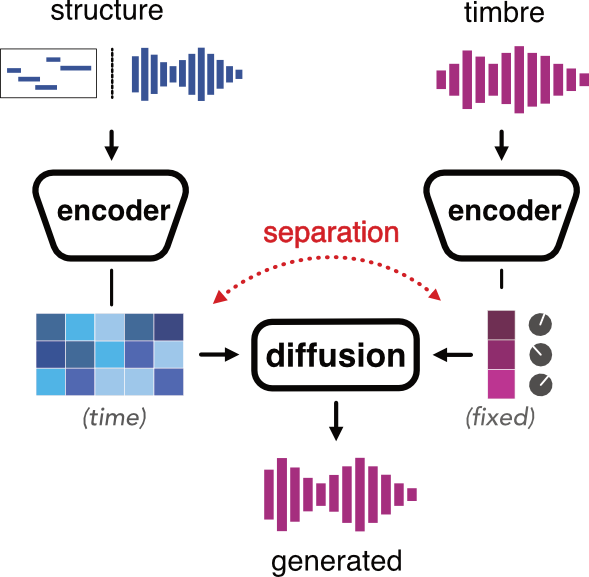

# AFTER training guide 

<!-- ## General principle  -->

__AFTER__ is a diffusion-based generative model that generates audio by blending two sources: a timbre representation, and a stream (either audio or MIDI) that shapes the signal structure (melody, dynamics) over time.

<p align="center"></p>


AFTER learns to map audio inputs into separated timbre and structure representations using two distinct encoders. Those representations are passed to a diffusion decoder that generates a transfer of structure information to the timbre target domain. 

The training is done in two phases : first learning a good timbre representation, then training the structure and diffusion decoder. 

AFTER operates in the latent space of a neural audio codec instead of directly generating audio waveform. The codec's task is to compress the high-dimensional audio into compact and informative embeddings, which enables the diffusion model to run more efficiently and focus on semantic content rather than high-frequency details. We provide more details about the autoencoder selection or training in [this section](#about-the-autoencoder). 

### Learning Timbre 


The first stage focuses on learning a timbre representation. By default, this is done following a [SimDINO](https://arxiv.org/abs/2306.00989) self-supervised objective.

It consists of creating multiple views of the same audio and training the model to map related samples to a similar timbre representation vector. In practice, this is done by randomly cropping different segments from the same audio file. The underlying assumption is simple: two different crops from the same source should share timbre, but contain different notes, rhythm and dynamics.

During data preprocessing, audio files are chunked by default into 12-seconds segments, while the training size corresponds to only 6-seconds. This means the model sees pairs of segments that are relatively close in time, and hence likely to share similar timbre features. If your dataset contains long recordings with stable timbre, increasing the chunk size (`--num_signal` in prepare_dataset) can improve performance by exposing the model to more structural variation per example.

However, two crops from the same file can share similar structure characteristics. If they contain the same harmony, similar note density, or nearly identical attacks, the encoder can encode those features instead of pure timbre. To prevent this, `after prepare_dataset` applies different data augmentations to each crop. By default, we use time-varying time-stretching and pitch shifting. Note that some augmentations may harm timbre consistency depending on the dataset (e.g. pitch-shifting speech). You can edit the augmentation settings in `after_scripts/prepare_dataset.py`.


### Learning separated spaces 


Once the timbre representation is learned, we train the structure encoder and diffusion model with a diffusion autoencoder framework. This means that the diffusion model must reconstruct a target signal from a noisy version, conditioned on timbre and structure representations. The timbre encoder is frozen during this phase.

Without constraints, the structure encoder could encode everything, making timbre irrelevant. To prevent this, AFTER introduces an adversarial classifier that tries to predict timbre information from the structure. The classifier weights are used to train the structure encoder to fail this prediction. 

The most important disentanglement hyperparameter for audio-to-audio training is `ADV_WEIGHT`. You can write your own config, or override it at launch time with the `--adv` flag.

- `--adv` is too low: structure leaks timbre, transfer becomes weak or inconsistent
- `--adv` is too high: the model loses local fidelity, pitch and rhythm tracking degrade

The ideal value depends on how entangled timbre and performance are in the dataset.

## MIDI

Using MIDI as the structure input simplifies the disentanglement problem. The model no longer needs to fight an audio structure encoder that can learn timbre information, so the MIDI configs set adversarial disentanglement to zero.

### Automatic MIDI Extraction

If you only have audio, you can ask dataset preparation to extract MIDI with Basic Pitch:

```bash
after prepare_dataset \
  --input_path /audio/folder \
  --output_path /datasets/after_latent_midi \
  --emb_model_path autoencoder_runs/AE_model_name/export.ts \
  --midi True
```

Transcription errors directly limit the quality of MIDI-to-audio training. If the transcription is rhythmically unstable, harmonically incomplete, or merges nearby notes, the diffusion model will reproduce those errors at inference time. 

### Using paired MIDI files

If you already have MIDI files you can use them instead:

```bash
after prepare_dataset \
  --input_path /audio_with_matching_midis \
  --output_path /datasets/after_latent_midi \
  --emb_model_path autoencoder_runs/AE_model_name/export.ts \
  --parser simple_midi
```

The files must be time-aligned with the audio files. The default `simple_midi` parser is defined in `after/dataset/parsers.py`. It assumes each MIDI file shares the audio filename and replaces the audio extension with `.mid`.

Example:

- `track01.wav` -> `track01.mid`

If your naming scheme differs, edit `simple_midi` directly or add a new parser in `after/dataset/parsers.py`, register it in `get_parser()`, and then pass that parser name with `--parser`.


### MIDI Time Resolution

By default MIDI is sampled at 4 times the latent space frame rate. If you need more precise timing, you can modify the config:

```gin
diffusion.utils.collate_fn_after:
    compress_tc = 4
```

## About the Autoencoder

The autoencoder is responsible for compressing audio into a compact latent representation used by the diffusion model. 

We provide code to train your own autoencoder. The architecture is a convolutional model inspired by approaches such as [RAVE](https://github.com/acids-ircam/RAVE) and Magenta [SpectroStream](https://arxiv.org/abs/2508.05207), designed to balance reconstruction quality and efficiency.

Training the autoencoder is typically the most computationally expensive part of the pipeline, and can take up to a week on a single RTX 4090 depending on dataset size and configuration.

Alternatively, you can use a pretrained model. RAVE models are a common choice, but they are often strongly regularized to enable timbre transfer, which can lead to imperfect reconstruction. In the context of AFTER where transfer is done by the diffusion model, this will unnecessarly limit the overall audio quality.

Another option is to use an off-the-shelf pretrained neural audio codec such as Music2Latent. This works well for offline generation, but for real-time applications you will need a codec that supports streaming inference and can be exported to TorchScript.


## Export and inference 

Once the model is trained you can export it to a **torchscript** file with the scripts `after export` and `after export_midi`.


The export script trains a small autoencoder to further compress the 6-dimensional timbre space to a 2-dimensional plane, which can be used to create a map that acts as a coarse control to navigate timbral features. The colors on the map are derived from the timbre vectors of the training dataset, colored by their labels. You can use the dataset identity (`--label_mode dataset`), the file names (`--label_mode file`) or any other metadata that you stored during data preprocessing (by writing you own parser in `after/dataset/parsers.py`). 

Note that this compression is lossy, meaning that using only the map will discard some fine timbre details. Furthermore, interpolations in the original timbre space are much smoother than interpolations performed on the map.